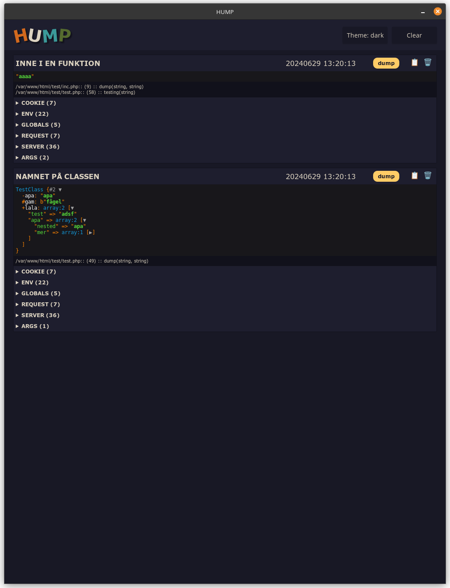
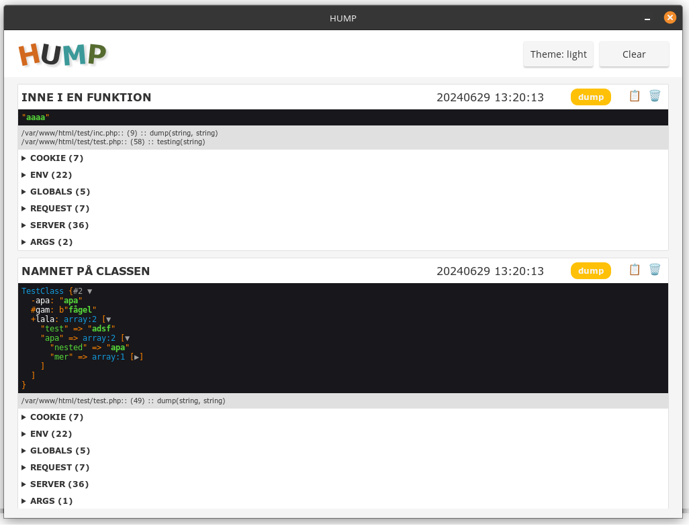

# HUMP

Local non-breaking dump-tool.

### Usage
Install client in your project and use.
```php
# Named dump 
hump(<name>,<item>);

#anonymous dump
hump(<item>);

```


### Extra
Adds trace and all globals to each dump.

### Docker-support
Sure, just make sure to add the following extra_hosts to your `docker-compose.yml`:
```yaml
services:
  php:
    image: php:8.2-apache
    ports:
      - 80:80
    volumes:
      - ../clients/PHP/:/var/www/html/
    extra_hosts:
      - "host.docker.internal:host-gateway"
```

### Theme-support.




